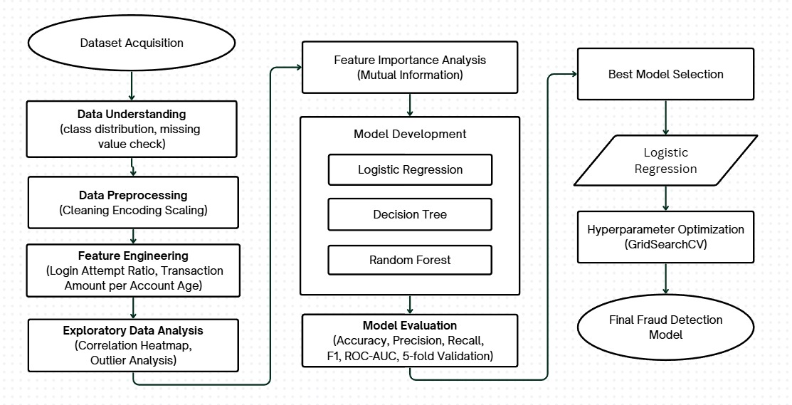
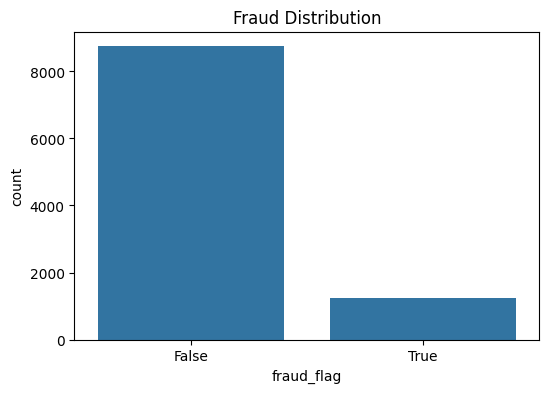
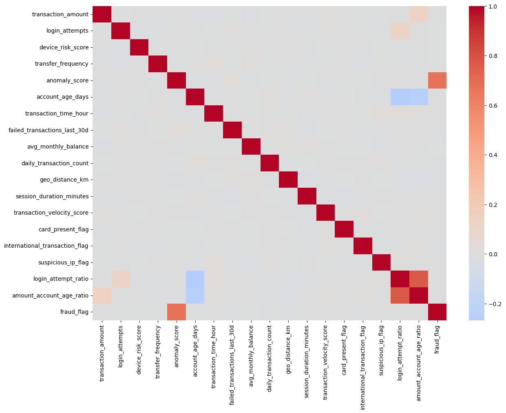
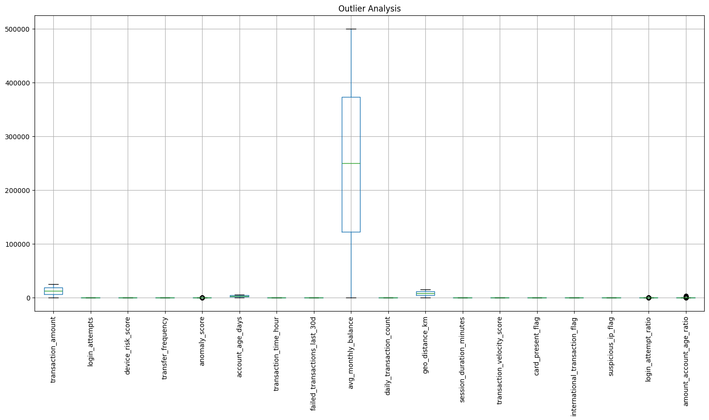
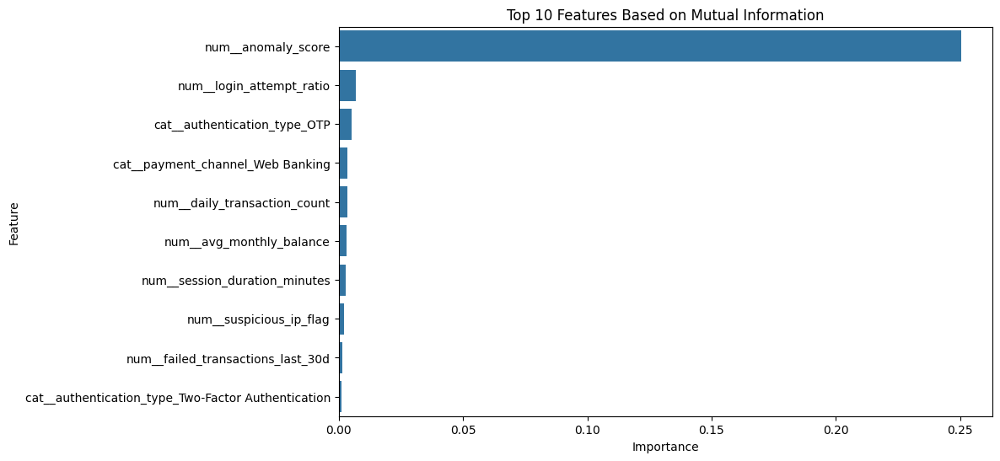
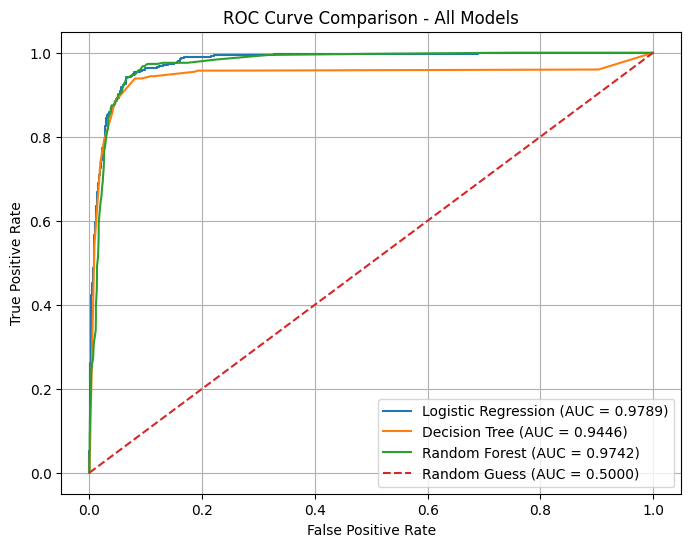
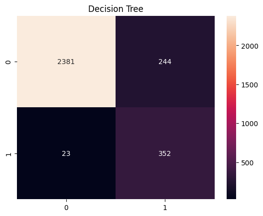
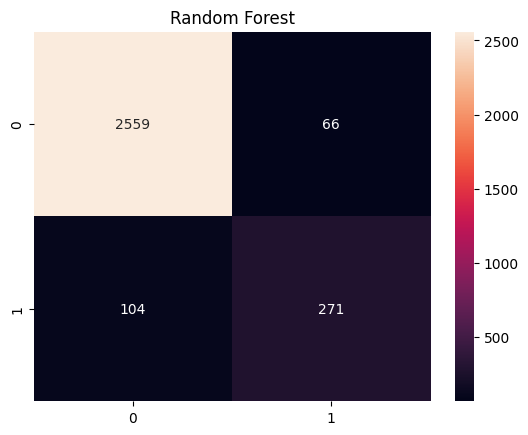

# Banking Fraud Detection using Machine Learning
This repository contains a machine learning coursework project completed for the **Machine Learning** course in the **Master of Data Science** programme at **Universiti Kebangsaan Malaysia (UKM)**.
The project compares multiple supervised machine learning algorithms for detecting fraudulent retail banking transactions using Python and Scikit-learn.

## Project at a Glance
| Item | Details |
|------|---------|
| Problem | Fraud Detection |
| Dataset | Retail Banking Fraud Dataset |
| Records | 10,000 |
| Features | 20 |
| Task | Binary Classification |
| Models | Logistic Regression, Decision Tree, Random Forest |
| Best Model | Logistic Regression |
| ROC-AUC | 0.9797 |
| Language | Python |

## Project Overview
Financial fraud is a major challenge for banking institutions due to the increasing volume of digital transactions. This project evaluates three supervised machine learning algorithms for classifying banking transactions as fraudulent or legitimate. Model performance is compared using multiple evaluation metrics to identify the most suitable approach for fraud detection.

## Dataset
This project uses the publicly available Retail Banking Fraud Dataset from Kaggle.
| Attribute | Value |
|------------|-------|
| Source | [Kaggle Dataset](https://www.kaggle.com/datasets/deepeshkansotia/banking-fraud-detection-and-risk-analytics-dataset) |
| Records | 10,000 |
| Features | 20 |
| Target | Fraud Flag |
| Task | Binary Classification |

## Methodology

The project follows a complete machine learning workflow beginning with data understanding and preprocessing, followed by feature engineering and exploratory data analysis. Three supervised classification models were developed and evaluated using multiple performance metrics. The best-performing model was then optimized using `GridSearchCV` to produce the final fraud detection model.

## Exploratory Data Analysis (EDA)
Before model development, EDA was conducted to better understand the dataset, identify potential issues, and examine relationships between variables.

### Fraud Distribution

The bar chart illustrates the class distribution of the target variable, showing that the dataset is imbalanced. 

### Correlation Heatmap

The correlation heatmap was used to examine relationships between numerical features and identify potential multicollinearity. Understanding feature correlations helps guide feature selection and model interpretation.

### Outlier Analysis

Boxplots were used to visualize the distribution of numerical variables and detect potential outliers. This analysis provides insight into data variability and supports decisions during preprocessing.

## Feature Engineering
Feature engineering and feature selection were performed to identify the most informative variables for fraud detection. Mutual Information was used to measure the dependency between each feature and the target variable.

### Top Features Based on Mutual Information

The feature ranking identifies the variables that contributed most to distinguishing fraudulent and legitimate transactions.

## Machine Learning Models
| Model |	Why it was chosen |
|------:|------------------:|
| Logistic Regression |	Baseline linear classifier with good interpretability |
| Decision Tree	| Captures non-linear decision boundaries |
| Random Forest	| Ensemble model that reduces overfitting and improves predictive performance |

## Model Evaluation
**Model Performance**
| Model | Accuracy | Precision | Recall | F1 Score | ROC-AUC |
|-------|---------:|----------:|-------:|---------:|--------:|
| Logistic Regression | 0.9257 | 0.6357 | **0.9493** | 0.7615 | **0.9789** |
| Random Forest | **0.9433** | **0.8042** | 0.7227 | 0.7612 | 0.9742 |
| Decision Tree | 0.9110 | 0.5906 | 0.9387 | 0.7250 | 0.9446 |

**ROC Comparison**

### Confusion Matrices
| Logistic Regression | Decision Tree | Random Forest |
|---------------------|---------------|---------------|
|  |  |  |

**Key Finding**
- Logistic Regression achieved the highest ROC-AUC score (0.9797).
- Feature engineering contributed to improved model performance.
- Class imbalance required careful evaluation using Recall and ROC-AUC rather than Accuracy alone.
- Logistic Regression was selected as the final model because it achieved the highest ROC-AUC and recall while remaining interpretable, making it well suited for fraud detection.

## Tech Stack
Python | Pandas | NumPy | Scikit-learn | Matplotlib | Google Colab

## Quick Start
1. Download the dataset from Kaggle.
2. Upload the dataset to Google Colab.
3. Open `Notebook.ipynb`.
4. Update the dataset path if required.
5. Run all cells sequentially.

## Notebook
The complete implementation is available in the notebook below.
- [Notebook](Notebook.ipynb)

## Documentation
- [Project Report](docs/Report.pdf)
- [Project Summary](docs/Summary.png)

## Contact
For any questions or feedback: dininadwah@gmail.com / [linkedin](https://www.linkedin.com/in/dznadwah/)
